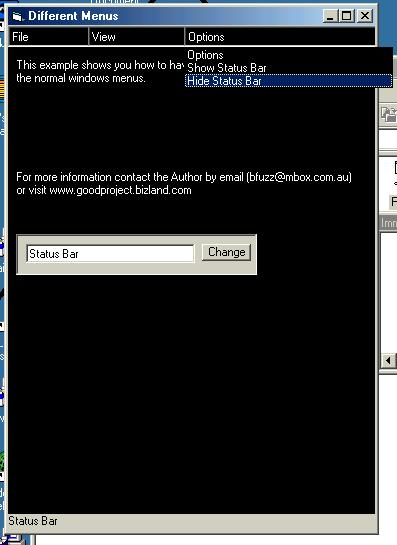



## Combo Boxes For Menus

### Description

This code shows you how to use combo boxes as a menu if you don't want to use the normal menus. Looks good. Get the latest version of all my code at www.gpa.2ya.com
 
### More Info
 

             |
---                |---
**Submitted On**   |2000-12-26 10:39:06
**By**             |[\-New\_Kid\-](https://github.com/Planet-Source-Code/PSCIndex/blob/master/ByAuthor/new-kid.md)
**Level**          |Beginner
**User Rating**    |4.0 (20 globes from 5 users)
**Compatibility**  |VB 6\.0
**Category**       |[Miscellaneous](https://github.com/Planet-Source-Code/PSCIndex/blob/master/ByCategory/miscellaneous__1-1.md)
**World**          |[Visual Basic](https://github.com/Planet-Source-Code/PSCIndex/blob/master/ByWorld/visual-basic.md)
**Archive File**   |[CODE\_UPLOAD1306912262000\.zip](https://github.com/Planet-Source-Code/new-kid-combo-boxes-for-menus__1-13887/archive/master.zip)

